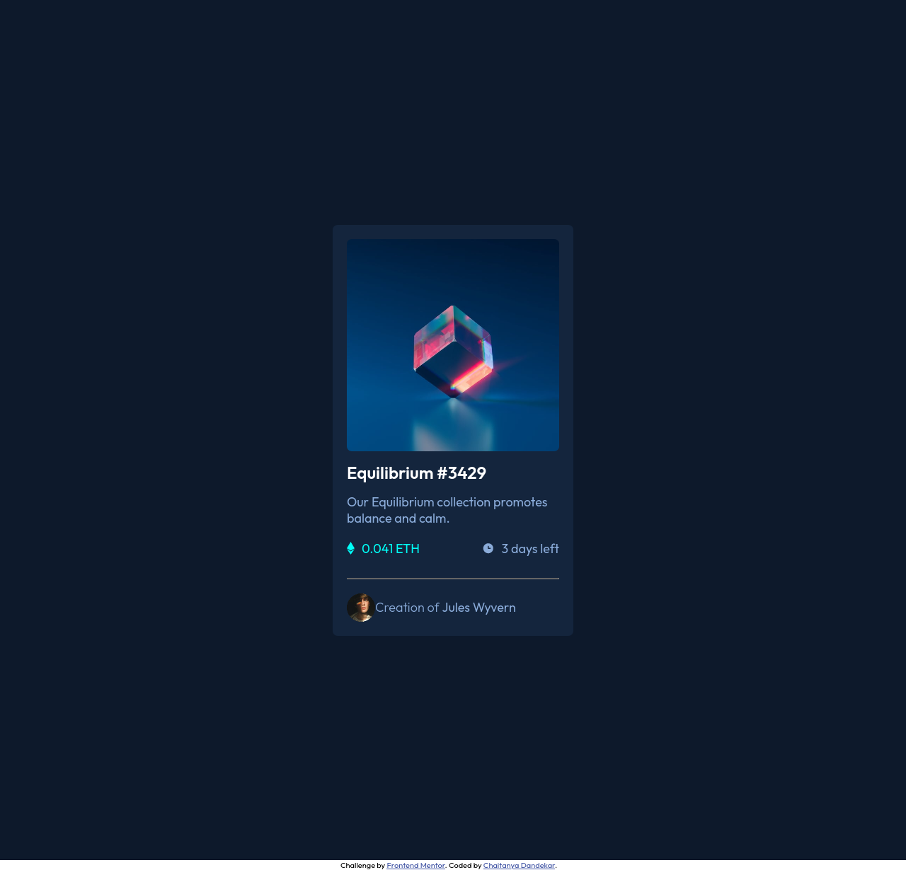
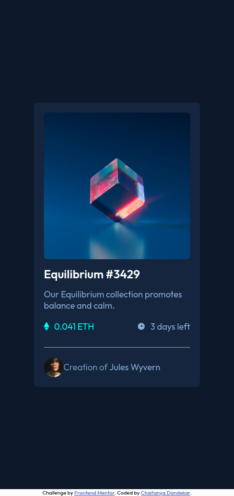

# Frontend Mentor - NFT preview card component solution

This is a solution to the [NFT preview card component challenge on Frontend Mentor](https://www.frontendmentor.io/challenges/nft-preview-card-component-SbdUL_w0U).

## Table of contents

- [Overview](#overview)
  - [The challenge](#the-challenge)
  - [Screenshot](#screenshot)
- [My process](#my-process)
  - [Built with](#built-with)
  - [What I learned](#what-i-learned)
  - [Continued development](#continued-development)
  - [Useful resources](#useful-resources)
- [Author](#author)

**Note: Delete this note and update the table of contents based on what sections you keep.**

## Overview

### The challenge

Users should be able to:

- View the optimal layout depending on their device's screen size
- See hover states for interactive elements

### Screenshot

Desktop Version

Mobile Version

## My process

### Built with

- Semantic HTML5 markup
- CSS custom properties
- Flexbox

### What I learned

- Css Overlay
- CSS Transitions
- CSS Psudo selectors

### Continued development

- Code Cleaning
- More on HTML and CSS Properties
- Adding Js Functionality
- Structurizing code

### Useful resources

- [CSS Image Overloay](https://www.youtube.com/watch?v=exb2ab72Xhs&t=416s) - This helped me for Overlay. Going to use this again in future developments.
- [CSS Properties](https://www.w3schools.com/css/) - This site basically helped me in almost every css issues.

## Author

- Frontend Mentor - [@chaitanyadandekar](https://www.frontendmentor.io/profile/chaitanyadandekar)
- LinkedIn - [Chaitanya Dandekar](https://www.linkedin.com/in/chaitanya-dandekar-060645205/)
